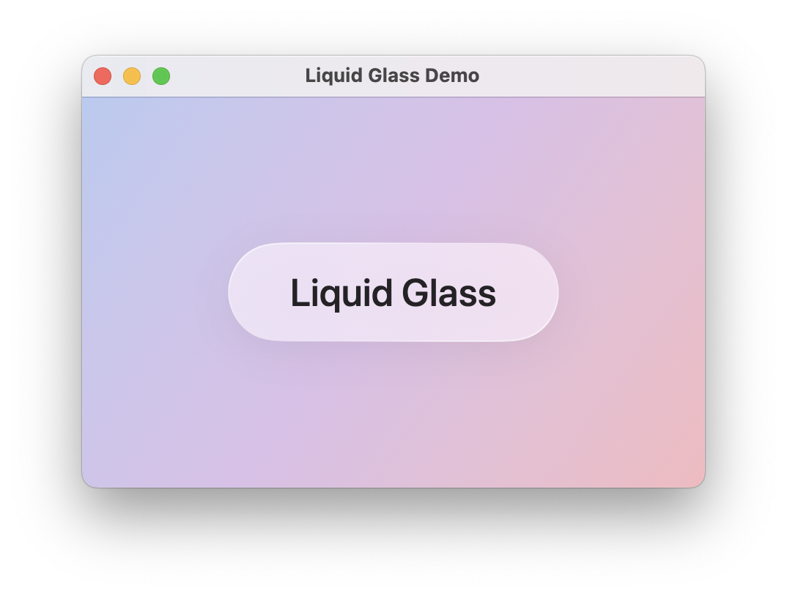
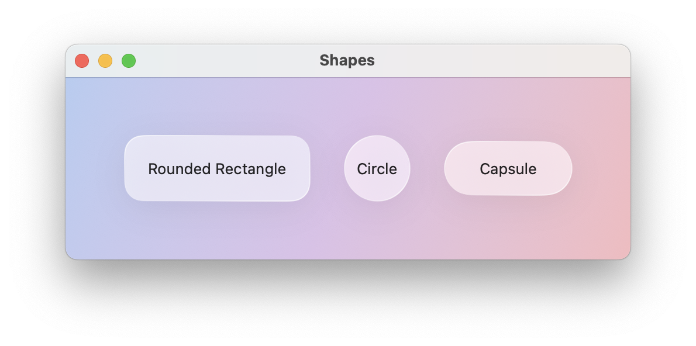
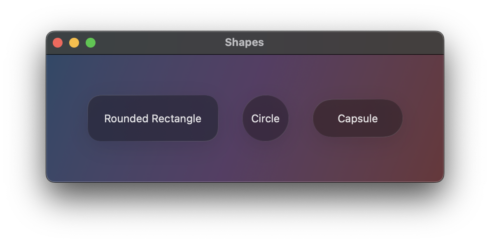

# LiquidGlass

[](https://swift.org)
[](https://developer.apple.com)
[](LICENSE)
[](https://swift.org/package-manager)

A stunning, lightweight SwiftUI library for creating frosted glass effects with customizable shapes and colors.



## Features

- Realistic frosted glass effects with highlights and shadows
- Built-in shapes: rounded rectangle, circle, capsule
- Customizable color tints
- Optional hover effects for macOS and iPadOS
- Automatic use of system `glassEffect` API when available (Platform 26+)
- Minimal dependencies, pure SwiftUI implementation
- Performance-optimized rendering
- Dark mode support

## Requirements

- iOS 15.0+ / macOS 12.0+
- Xcode 15.0+
- Swift 5.9+

## Installation

### Swift Package Manager

Add LiquidGlass to your project using Xcode:

1. File > Add Package Dependencies...
2. Enter the repository URL:

   ```text
   https://github.com/xnxjoe/LiquidGlass.git
   ```

3. Select the version or branch you want to use
4. Click "Add Package"

Or add it to your `Package.swift` file:

```swift
dependencies: [
    .package(url: "https://github.com/xnxjoe/LiquidGlass.git", from: "1.0.0")
]
```

Then add `LiquidGlass` to your target dependencies:

```swift
targets: [
    .target(
        name: "YourTarget",
        dependencies: ["LiquidGlass"]
    )
]
```

## Quick Start

### Basic Usage

Import LiquidGlass and apply the glass effect to any SwiftUI view:

```swift
import SwiftUI
import LiquidGlass

struct ContentView: View {
    var body: some View {
        Text("Hello, Glass!")
            .padding()
            .liquidGlass(shape: .roundedRect(cornerRadius: 16))
    }
}
```

### Using GlassStyle Directly

For advanced control, use ``GlassStyle`` as a background:

```swift
VStack {
    Text("Custom Glass")
        .padding()
}
.background(
    GlassStyle(shape: .roundedRect(cornerRadius: 20))
        .tint(.purple)
)
```

## Documentation

Full API documentation is available via Swift DocC. See the [Getting Started](Sources/LiquidGlass/Documentation.docc/GettingStarted.md) for details, symbol links, and advanced usage.

## Examples

### Glass Cards

```swift
VStack(alignment: .leading, spacing: 12) {
    HStack {
        Image(systemName: "sparkles")
            .font(.title2)
            .foregroundStyle(.blue)
        VStack(alignment: .leading, spacing: 4) {
            Text("Glass Card")
                .font(.headline)
            Text("Beautiful frosted effect")
                .font(.caption)
                .foregroundStyle(.secondary)
        }
        Spacer()
    }
}
.padding()
.liquidGlass(shape: .roundedRect(cornerRadius: 16))
```

### Interactive Elements

```swift
Button("Tap Me") {
    // Action
}
.padding()
.liquidGlass(shape: .capsule, hoverEffect: true)
.buttonStyle(.plain)
```

### Shape Variations

```swift
HStack(spacing: 20) {
    GlassStyle(shape: .roundedRect(cornerRadius: 12))
        .frame(width: 100, height: 100)
    GlassStyle(shape: .circle)
        .frame(width: 100, height: 100)
    GlassStyle(shape: .capsule)
        .frame(width: 100, height: 60)
}
```

## Color Scheme Adaptation

LiquidGlass automatically adapts to light and dark color schemes:

 

## Architecture

- **BackgroundShape** – Enum defining available shapes with optimized path generation
- **GlassStyle** – Core view that renders the glass effect with materials and gradients
- **GlassEffectModifier** – ViewModifier that applies glass backgrounds with Platform 26+ support
- **View+LiquidGlass** – Convenient extension for easy integration

## Contributing

Contributions are welcome! Please submit a Pull Request or open an issue to discuss major changes.

## License

LiquidGlass is available under the MIT license. See the [LICENSE](LICENSE) file for more info.

## Acknowledgments

- Built with Xcode and GitHub Copilot using SwiftUI
- Inspired by Apple's Liquid Glass Design

If you find this package useful, please consider giving it a star on GitHub!
