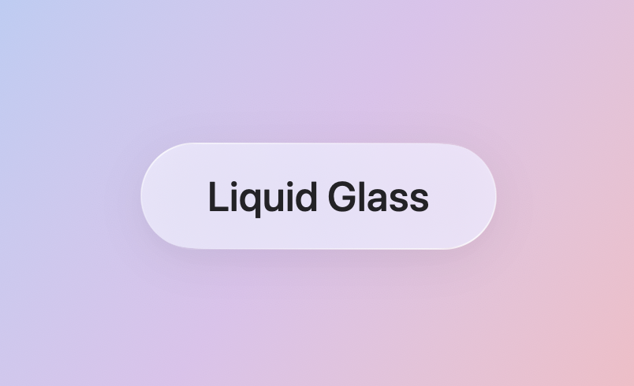
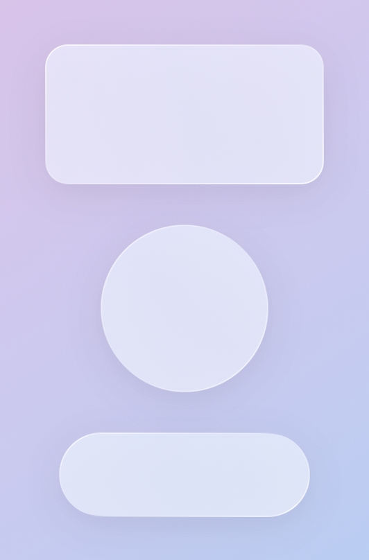
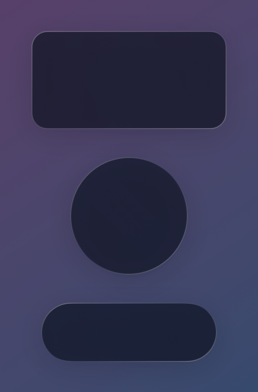

# LiquidGlass

[](https://swift.org)
[](https://developer.apple.com)
[](LICENSE)
[](https://swift.org/package-manager)

一个优雅、轻量级的 SwiftUI 库，用于创建令人惊艳的磨砂玻璃效果，支持自定义形状和颜色。

[English](README.md) | 简体中文



## ✨ 特性

- 🎨 **精美的玻璃效果** - 逼真的磨砂玻璃，带有细微的渐变和阴影
- 🔷 **多种形状** - 内置支持圆角矩形、圆形和胶囊形
- 🎭 **自定义色调** - 可为玻璃表面应用任何颜色色调
- 🖱️ **悬停效果** - macOS 和 iPadOS 的可选悬停交互
- 🔄 **Platform 26+ 集成** - 可用时自动使用系统 `glassEffect` API
- 📦 **轻量级** - 零依赖，纯 SwiftUI 实现
- ⚡ **性能优化** - 高效的路径生成和渲染
- 🌓 **深色模式支持** - 自动适配亮色和暗色主题

## 📋 系统要求

- iOS 15.0+ / macOS 12.0+
- Xcode 15.0+
- Swift 5.9+

## 📦 安装

### Swift Package Manager（推荐）

使用 Xcode 将 LiquidGlass 添加到您的项目：

1. 文件 > 添加包依赖项...
2. 输入仓库地址：

    ```text
    https://github.com/xnxjoe/LiquidGlass.git
    ```

3. 选择要使用的版本或分支
4. 点击"添加包"

或在 `Package.swift` 文件中添加：

```swift
dependencies: [
    .package(url: "https://github.com/xnxjoe/LiquidGlass.git", from: "1.0.0")
]
```

然后将 `LiquidGlass` 添加到目标依赖：

```swift
targets: [
    .target(
        name: "YourTarget",
        dependencies: ["LiquidGlass"]
    )
]
```

## 🚀 快速开始

### 基础用法

导入 LiquidGlass 并将玻璃效果应用到任何 SwiftUI 视图：

```swift
import SwiftUI
import LiquidGlass

struct ContentView: View {
    var body: some View {
        Text("你好，玻璃！")
            .padding()
            .liquidGlass(shape: .roundedRect(cornerRadius: 16))
    }
}
```

### 使用自定义色调

为玻璃效果添加彩色色调：

```swift
Text("彩色玻璃")
    .padding(20)
    .liquidGlass(shape: .capsule)
    .tint(.blue)
```

### 直接使用 GlassStyle

如需更多控制，可使用 `GlassStyle` 作为背景：

```swift
VStack {
    Text("自定义玻璃")
        .padding()
}
.background(
    GlassStyle(shape: .roundedRect(cornerRadius: 20))
        .tint(.purple)
)
```

## 📖 文档

### View 扩展

应用玻璃效果最简单的方式是使用 `.liquidGlass()` 修饰符：

```swift
func liquidGlass(
    shape: BackgroundShape,
    hoverEffect: Bool = false,
    id: String? = nil,
    namespace: Namespace.ID? = nil
) -> some View
```

**参数：**

- `shape` - 背景形状（`.roundedRect()`、`.circle` 或 `.capsule`）
- `hoverEffect` - 启用悬停交互（默认：`false`）
- `id` - 匹配几何效果的可选标识符（Platform 26+）
- `namespace` - 匹配几何效果的可选命名空间（Platform 26+）

### BackgroundShape

从三种内置形状中选择：

```swift
// 自定义圆角半径的圆角矩形
.liquidGlass(shape: .roundedRect(cornerRadius: 16))

// 正圆形
.liquidGlass(shape: .circle)

// 胶囊形（药丸形）
.liquidGlass(shape: .capsule)
```

### GlassStyle

创建独立的玻璃背景：

```swift
GlassStyle(shape: .roundedRect(cornerRadius: 12))
    .tint(.blue)
    .frame(width: 200, height: 100)
```

## 💡 示例

### 玻璃卡片

```swift
VStack(alignment: .leading, spacing: 12) {
    HStack {
        Image(systemName: "sparkles")
            .font(.title2)
            .foregroundStyle(.blue)
        
        VStack(alignment: .leading, spacing: 4) {
            Text("玻璃卡片")
                .font(.headline)
            Text("精美的磨砂效果")
                .font(.caption)
                .foregroundStyle(.secondary)
        }
        
        Spacer()
    }
}
.padding()
.liquidGlass(shape: .roundedRect(cornerRadius: 16))
```

### 交互式按钮

```swift
Button("点击我") {
    // 操作
}
.padding()
.liquidGlass(shape: .capsule, hoverEffect: true)
.buttonStyle(.plain)
```

### 多形状画廊

```swift
HStack(spacing: 20) {
    GlassStyle(shape: .roundedRect(cornerRadius: 12))
        .tint(.blue)
        .frame(width: 100, height: 100)
    
    GlassStyle(shape: .circle)
        .tint(.pink)
        .frame(width: 100, height: 100)
    
    GlassStyle(shape: .capsule)
        .tint(.green)
        .frame(width: 100, height: 60)
}
```

### 自定义色调颜色

```swift
VStack(spacing: 20) {
    Text("蓝色玻璃")
        .liquidGlass(shape: .roundedRect(cornerRadius: 12))
        .tint(.blue)
    
    Text("紫色玻璃")
        .liquidGlass(shape: .roundedRect(cornerRadius: 12))
        .tint(.purple)
    
    Text("绿色玻璃")
        .liquidGlass(shape: .roundedRect(cornerRadius: 12))
        .tint(.green)
}
```

## 🎨 自定义

### 颜色主题

LiquidGlass 自动适配亮色和暗色模式：




```swift
// 在浅色和深色模式下都很好看
Text("自适应玻璃")
    .padding()
    .liquidGlass(shape: .roundedRect(cornerRadius: 16))
```

### 悬停效果

在 macOS 和 iPadOS 上启用交互式悬停效果：

```swift
Text("悬停在我上面")
    .padding()
    .liquidGlass(shape: .capsule, hoverEffect: true)
```

## 🏗️ 架构

LiquidGlass 采用模块化架构构建：

- **BackgroundShape** - 定义可用形状的枚举，具有优化的路径生成
- **GlassStyle** - 使用材质和渐变渲染玻璃效果的核心视图
- **GlassEffectModifier** - 应用玻璃背景的 ViewModifier，支持 Platform 26+
- **View+LiquidGlass** - 便捷的扩展，易于集成
- **MultiColorRoundedRectangle/Capsule** - 用于多渐变描边的辅助视图

## 🧪 测试

运行测试套件：

```bash
swift test
```

使用详细输出运行测试：

```bash
swift test --verbose
```

测试套件包括：

- BackgroundShape 路径生成测试
- GlassStyle 初始化和色调测试
- View 扩展集成测试
- 路径验证和边界检查
- 性能基准测试

## 🤝 贡献

欢迎贡献！请随时提交 Pull Request。对于重大更改，请先开启 issue 讨论您想要更改的内容。

### 开发设置

1. 克隆仓库：

    ```bash
    git clone https://github.com/xnxjoe/LiquidGlass.git
    cd LiquidGlass
    ```

2. 在 Xcode 中打开：

    ```bash
    open Package.swift
    ```

3. 构建和测试：

    ```bash
    swift build
    swift test
    ```

## 📄 许可证

LiquidGlass 使用 MIT 许可证。更多信息请查看 [LICENSE](LICENSE) 文件。

## 🙏 致谢

- 使用 SwiftUI 用 Xcode 和 Github Copilot 构建
- 灵感来自现代玻璃态设计趋势
- 感谢 Swift 社区的反馈和贡献

## 📬 联系方式

- GitHub: [@xnxjoe](https://github.com/xnxjoe)
- Issues: [GitHub Issues](https://github.com/xnxjoe/LiquidGlass/issues)

## 🗺️ 路线图

- [ ] 额外的形状支持（多边形、自定义路径）
- [ ] 玻璃过渡的动画预设
- [ ] 无障碍改进
- [ ] 文档网站
- [ ] 视频教程和示例
- [ ] 社区展示画廊

---

由 [xnxjoe](https://github.com/xnxjoe) 用 ❤️ 制作

如果您觉得这个包有用，请在 GitHub 上给它一个 ⭐️！
